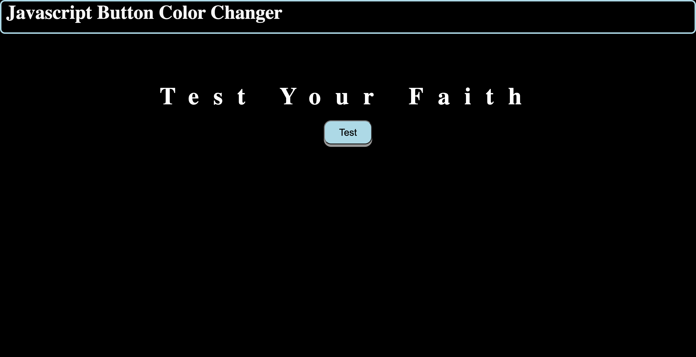

# Javascript Button Color Changer!
## **Description**
Center button changes colors of the background when clicked.
---
## Tools used
>1. HTML
>2. CSS
>3. JAVASCRIPT

## Link
[button-changer]( https://mcowley1.github.io/Javascript-button-changer/)

